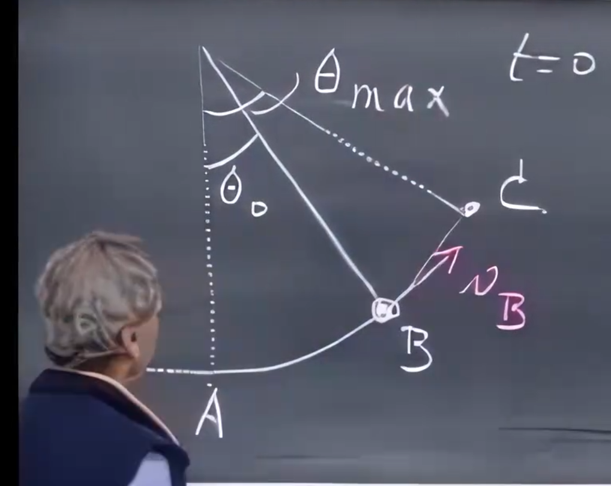
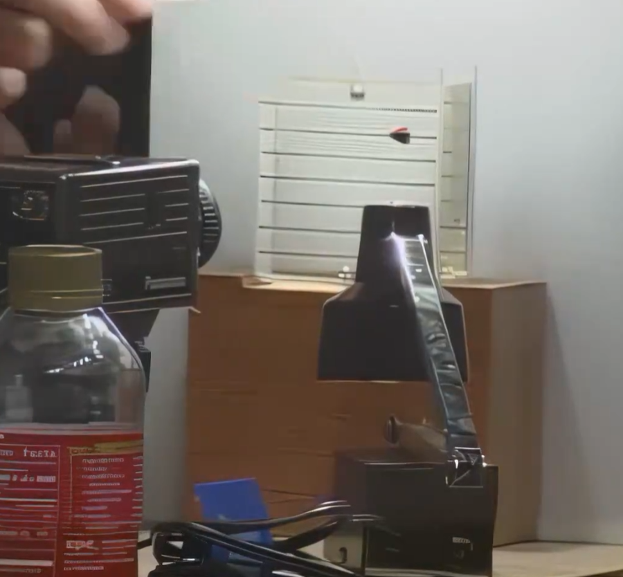
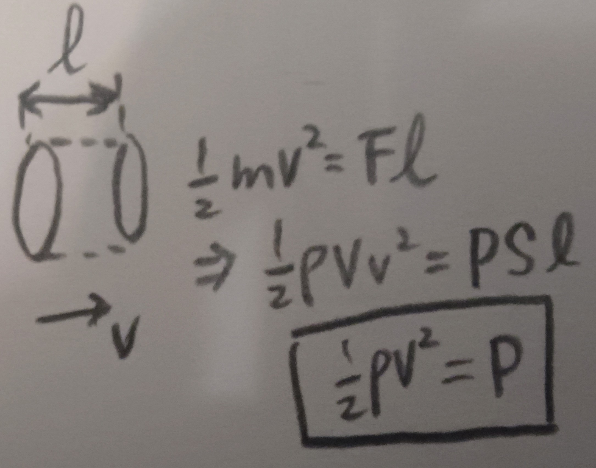
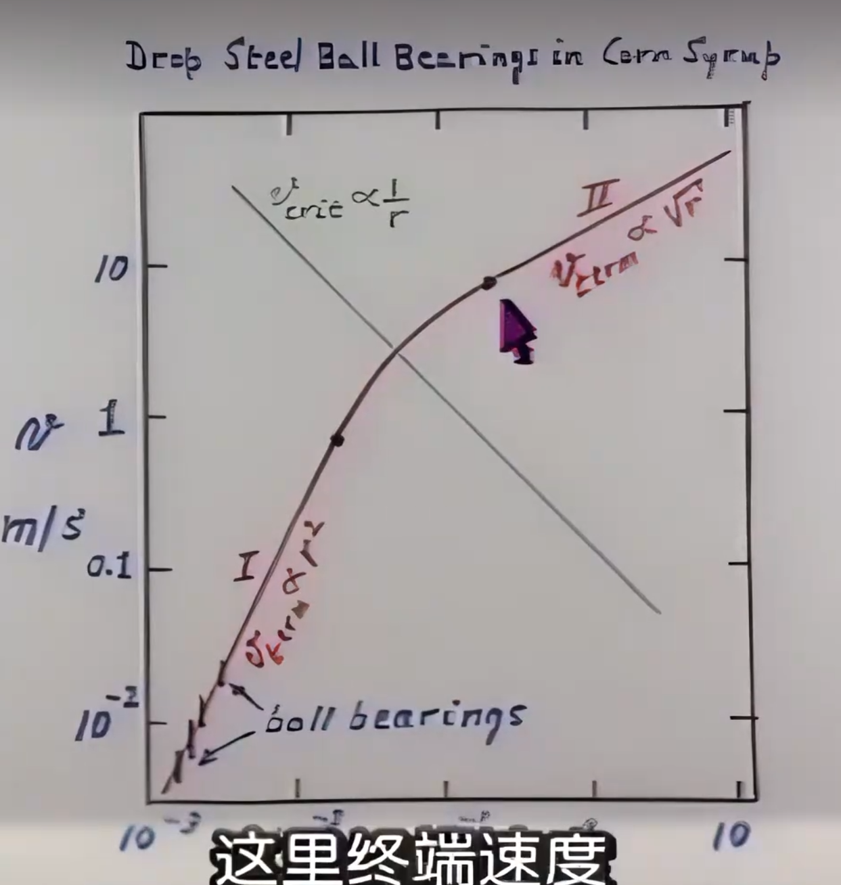
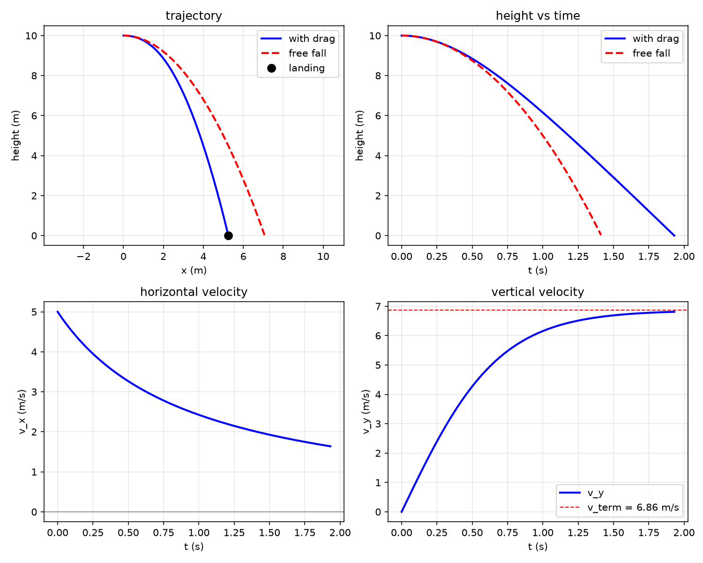

# 1.1 

### P 1.1

There is a [[pendulum]] of length $l = 1\ \text{m}$ which starts at position B at $t = 0$, with initial angle $\theta _0 = 3^\circ$.
At the same moment, it is given an upward tangential speed $v_b = 0.1\ \text{m/s}$. 
$AO \cdot g = |AO|\cdot|g|, \quad g = 10\ \text{m/s}^2$
1. What is the maximum angle reached after $t = 0$ ?
2. consider $\theta$ at every moment, $\theta (t) = \theta _{max} \cos(\frac{2\pi}{T} t + \phi)$, what are $\phi$ and $T$ ?

#### ( 1 )
$$
K_b + P_b = P_c
$$
Since
$$
\lim_{x \to 0}{\frac{1-\cos x}{\frac{1}{2}x^2}} = 1 \tag{1}
$$
use the small-angle #approximation:

$$
\begin{aligned}
\frac{mv_b^2}{2} + mgl(1-\cos \theta _0) &= mgl(1-\cos \theta _{max}) \\
mv_b^2 + mgl\theta _0^2 &= mgl\theta _{max}^2 \\
\left[\frac{v_b^2}{gl} +  \theta _0^2\right]^{1/2} &= \theta _{max} \\
\left[\frac{0.01}{10} + (\frac{3\times2\pi}{360})^2\right]^{1/2} &= \theta _{max}
\end{aligned}
$$
finally, we get:
$$
\boxed{\theta \approx 0.0612\ \text{rad} \approx 3.51^\circ}
$$

#### ( 2 )

first, consider $\phi$ :
$$
\phi = \arccos(\frac{\theta _0}{\theta _{max}})
$$
then, T :
$$
\omega = \frac{2\pi}{T}
$$
so we need to calculate $\omega$:
because of $3.5^\circ < 5^\circ$, we can use an #approximation:
$$
\lim_{x \to 0}\frac{\sin x}{x} = 1 \\

$$
and then
$$
\begin{aligned}
F &= -mg\theta \\
\ddot{x} &= -g\frac{x}{l} \\
x &= A\sin(\sqrt \frac{g}{l}t + \phi)
\end{aligned}
\to w = \sqrt \frac{g}{l}
$$
$$
\boxed{
    \begin{aligned}
    \phi &= \arccos(\frac{\theta _0}{\theta _{max}}) \approx 31.2^\circ \\
    T &= 2\pi\sqrt\frac{l}{g} \approx 1.99\ \text{s}
    \end{aligned}
}
$$

# 1.2
## resistive force

To general objects move in fluid, we can analysis it's force by two terms.
two terms are enough for most of the case.

$$
\hat{F} = (k_1v+k_2v^2)\hat{v} 
$$

specifically, for sphere, we get:
$$
F_{resis} = C_1rv + C_2r^2v^2
$$
we call     $C_1rv$     `viscous term` and    $C_2r^2v^2$    `pressure term`.
$C_1$    is impacted heavily by temperature, and    $C_2$    is very close to    $\rho$ .

viewing this equation, we can figure out why pressure term have $r^2$
in it -- because    $F_p=r^2\pi p$    but why    $v^2$    exists?  we can roughly think like this:

consider a round surface with area $S$ moving through the fluid with speed $v$; it moves a total distance $l$. conservation of energy tells us   $\frac{1}{2}mv^2 = Fl \to \frac{1}{2}\rho v^2 = P$
so, $r^2\pi \rho v^2$ might be more precise.
look, we just pulled the hidden factors out of $C_2$! but don't be so happy: the fluid behind the surface will also push it, and there are differences between a sphere and a flat circular surface.
so we still need    $C_d \frac{1}{2}r^2\pi \rho v^2$    to fix our term.
to Sphere,    $C_d \approx 0.47$  so pressure term roughly equal to $0.7536\rho r^2v^2$ .

### critical velocity

The `viscous term` dominates at low speed, while the `pressure term` dominates at high speed.

$C_1v_cr = C_2v_c^2r^2 \to v_c=\frac{C_1}{C_2r}$

$$
\begin{aligned}
&v>>v_c:\\
&F_{resis} \approx C_2r^2v^2\\
\\
&v<<v_c:\\
&F_{resis} \approx C_1rv
\end{aligned}
$$
this is very useful when we start calculate the termainal velocity.
the equation below is complex.
$$
mg - (C_1v_{term}r + C_2v_{term}^2r^2) = \dot{v} 
$$

but we can simiplify it with the #approximation

To `free falling` objs
we know:
$$
\begin{aligned}
&mg = C_2r^2v_{term}^2 \\
\to &v_{term}=\frac{1}{r}\sqrt{\frac{\rho Vg}{C_2}} \propto r^{1/2} \\
&mg = C_1v_{term}r \\
\to &v_{term}=\frac{\rho Vg}{C_1r} \propto r^2 \\
\end{aligned}
$$

notice:
here we get the $r^\alpha$ by ignore the consts. only $V$, $r$ changed by $r$.
so we ignore $g$ $\rho$...

if we draw a picture of $v_{term}$-$r$
we get:

### P 1.1

at    $t=0$   , a ball of    $r=0.5\ \text{m}$    $m=1\text{kg}$    at the height    $h=10\ \text{m}$    gained a horizontal velocity    $v_i=5\ \text{m/s}$    . At the same time, it started move.
the    $g=10 \ \text{m/s}^2$    and the air    $C_1=3.1\times 10^{-4}\ \text{kg/(s m)}$    , $C_2=0.85\ \text{kg/m}^3$    . 

What's the ball's position   $(x, y)$    at every moment    $t$    when it's falling?

#### S:

$$
v_c = \frac{C_1}{C_2r} \approx \frac{3.1\times 10^{-4}}{0.85\times 0.5} \approx 7.3\times 10^{-4}\ \text{m/s}
$$
since $v_0 = 5\ \text{m/s} \gg v_c$, we can ignore the viscous term anyway.
take $y$-axis pointing down, origin at the launch point, ground at $y=h$.
$$
\begin{aligned}
m\dot{v}_x &= -C_2r^2v_x^2\\
m\dot{v}_y &= mg - C_2r^2v_y^2
\end{aligned}
\to \quad K\equiv \frac{C_2r^2}{m}:\ 
\begin{aligned}
\frac{\mathrm{d}v_x}{\mathrm{d}t} &= -Kv_x^2\\
\frac{\mathrm{d}v_y}{\mathrm{d}t} &= g - Kv_y^2
\end{aligned}
$$
solve the x-ODE:
$$
\begin{aligned}
\int v_x^{-2}\mathrm{d}v_x &= -\int K\mathrm{d}t\\
-\frac{1}{v_x} &= -Kt + C\\
v_x(0) = v_0 \to C &= -\frac{1}{v_0}\\
\boxed{v_x(t) = \frac{v_0}{1+Kv_0t}}
\end{aligned}
$$
for the y-ODE:
$$
\int \frac{\mathrm{d}v_y}{g-Kv_y^2}=\int \mathrm{d}t
$$
emm... i asked DeepSeek for help:
$$
\begin{aligned}
& \text{Solve } \int \frac{\mathrm{d}v_y}{C - K v_y^2} = \int \mathrm{d}t, \quad C>0,\; K>0. \\[2pt]
& \text{Let } \alpha = \sqrt{\frac{C}{K}}, \quad \text{so } C = K\alpha^2. \\[2pt]
& \text{Then } \int \frac{\mathrm{d}v_y}{K(\alpha^2 - v_y^2)} = \int \mathrm{d}t. \\[2pt]
& \text{Use partial fractions: } 
\frac{1}{\alpha^2 - v_y^2} = \frac{1}{2\alpha}\left(\frac{1}{\alpha - v_y} + \frac{1}{\alpha + v_y}\right). \\[2pt]
& \text{Integrate: } 
\frac{1}{2\alpha K} \int \left(\frac{1}{\alpha - v_y} + \frac{1}{\alpha + v_y}\right)\mathrm{d}v_y = \int \mathrm{d}t. \\[2pt]
& \Longrightarrow \frac{1}{2\alpha K} \left[ -\ln|\alpha - v_y| + \ln|\alpha + v_y| \right] = t + C_1. \\[2pt]
& \Longrightarrow \frac{1}{2\alpha K} \ln\left|\frac{\alpha + v_y}{\alpha - v_y}\right| = t + C_1. \\[2pt]
& \text{Since } \alpha K = \sqrt{CK}, \quad 
\ln\left|\frac{\alpha + v_y}{\alpha - v_y}\right| = 2\sqrt{CK}\,(t + C_1). \\[2pt]
& \text{Let } A = e^{2\sqrt{CK}\,C_1}, \quad 
\frac{\alpha + v_y}{\alpha - v_y} = A e^{2\sqrt{CK}\,t}. \\[2pt]
& \text{Cross-multiply: } 
\alpha + v_y = A e^{2\sqrt{CK}\,t}(\alpha - v_y). \\[2pt]
& \text{Solve for } v_y: \quad 
v_y\left(1 + A e^{2\sqrt{CK}\,t}\right) = \alpha\left(A e^{2\sqrt{CK}\,t} - 1\right). \\[2pt]
& \boxed{v_y(t) = \alpha \cdot \frac{A e^{2\sqrt{CK}\,t} - 1}{A e^{2\sqrt{CK}\,t} + 1}}, 
\quad \alpha = \sqrt{\frac{C}{K}}. \\[2pt]
& \text{If } v_y(0)=v_0, \text{ then } A = \frac{\alpha + v_0}{\alpha - v_0} \quad (v_0 \neq \alpha).
\end{aligned}
$$
here $C\equiv g$, $K\equiv C_2r^2/m$ in the block above. since the ball starts with $v_y(0)=0$, we have $A=1$, then
$$
\boxed{v_y(t)=\sqrt{\frac{g}{K}}\tanh(\sqrt{gK}\ t)}
$$so, we can calculate the $x(t)$ and $y(t)$ :  
$$
\begin{aligned}
x(t) &= \int v_x(t)\,\mathrm{d}t = \int \frac{v_0}{1+Kv_0t}\,\mathrm{d}t\\
&= \frac{1}{K}\ln(1+Kv_0t) + C_x\\
\text{because} \ x(0)=0 \to C_x = 0\\
&\boxed{x(t)=\frac{m}{C_2r^2}\ln\left(1+\frac{C_2r^2v_0}{m}t\right)}
\end{aligned}
$$

$$
\begin{aligned}
y(t) &= \int \sqrt{\frac{g}{K}}\tanh(\sqrt{gK}\ t)\,\mathrm{d}t\\
\text{let } u = \sqrt{gK}\,t \to &= \frac{1}{K}\int \tanh u\,\mathrm{d}u\\
&= \frac{1}{K}\ln(\cosh u) + C_y\\
&= \frac{m}{C_2r^2}\ln\cosh\left(\sqrt{\frac{gC_2r^2}{m}}\,t\right) + C_y\\
\text{because y(0) = 0} \to C_y = 0\\
&\boxed{y(t)=\frac{m}{C_2r^2}\ln\left[\cosh\left(\sqrt{\frac{gC_2r^2}{m}}\,t\right)\right]}
\end{aligned}
$$
note: $y(t)$ is the distance fallen (y-axis down); the ball hits the ground at $y=h$, so the result holds for $0\le t\le t_{\text{land}}$.
ok that's the result... a little bit complex, right?

the curve looks like this:

