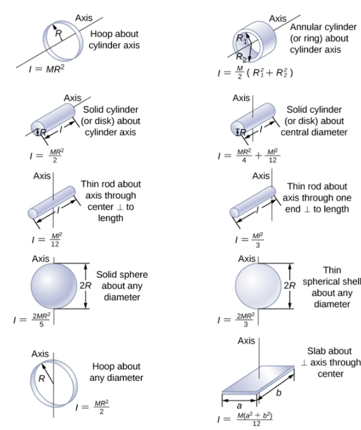

## rotate energy

when object is rotating, we can cut it into small parts and add their $E_k$ up to get the rotate energy of the object

$$
\int{\frac{1}{2}\omega^2 r_i^2 \mathrm{d}m}
$$

for an example: for a thin round plate rotate by the axis through its center and perpendicular to the plane.
$$
\begin{aligned}
&\int_0^{2\pi}\int_0^R\frac{1}{2}\omega^2r^2\rho \mathrm{d}r\ r\mathrm{d}\theta\\
=&\int_0^{2\pi}\frac{1}{8}\omega^2r^4 \rho\mathrm{d}\theta\\
=&\frac{1}{4}\omega^2\pi r^4\rho\\
\text{because }&\pi r^2\rho=m \text{, so:}\\
=&\frac{1}{4}\omega^2r^2m
\end{aligned}
$$

did you noticed? there are some values never changed. they are $\omega$ , $\rho$ , $\frac{1}{2}$ .
$$
\begin{aligned}
&\int \frac{1}{2}\omega^2r_i^2\mathrm{d}m=\frac{1}{2}I\omega^2\\
\to &I=\int r_i^2\mathrm{d}m
\end{aligned}
$$
that's close to $\frac{1}{2}mv^2$ , right?

so, the $I$ of the example ahead is $\frac{1}{2}r^2m$

here comes a table that contain some usual $I$ s

## Moment& Torque

moment is usually used in physics context and toque is usually used in engineering context.
### definition

$$
\vec{M}=\vec{r}\times\vec{F}
$$
when moment conserve, the object dose not rotate.
you can under stand it roughly by the principle of leverage.