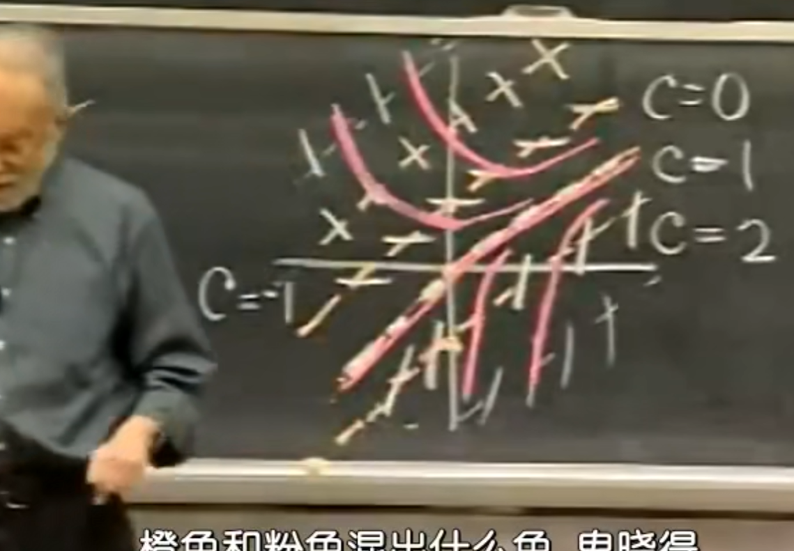

# 1-ODE

$
\dot{y} = f(x, y)
$

# direction feild

to every point in $\mathbb{R}^2$, we draw a small line element of slop $f(x, y)$ at $(x, y)$ (if it is defined)
it's direction graph of $f(x, y)$

# integral curve

if we pick a point in direction graph, then find two points at the line element's two sides, then continuely do this, we will get a curve, it's an integral curve. an intergral curve corresponds to a solution, a solution corresponds to an integral curve

# draw a direction field

1. pick points and draw line elements (program)
2. draw isocline (human)

### draw isocline
solve $C = f(x, y)$ and draw it on $\mathbb{R}^2$, every line element on this line have the same slop C (it is called isocline of C)
then we can picture the direction field roughly.  

>[p 1.1] drawing the direction field of $\dot y = -y + x + 1$ 

# two conclutions

1. two distinct integral curves never intersect (cross): if $f$ is continuous and locally Lipschitz in $y$ on an open region $D \subset \mathbb{R}^2$ (in particular if $f$ and $\partial f/\partial y$ are continuous on $D$), then by the Picard–Lindelöf theorem, through every point of $D$ there passes exactly one integral curve. hence, if two solutions $y_1, y_2$ satisfy $y_1(x_0) = y_2(x_0)$ for some $x_0$, then $y_1 \equiv y_2$ on the common part of their intervals; so distinct integral curves have no common point.

2. two distinct integral curves are never tangent to each other: if they were tangent at a point $(x_0, y_0)$, they would both pass through $(x_0, y_0)$ with the same slope $f(x_0, y_0)$, and by the same uniqueness result they would coincide. therefore, under the condition in (1), distinct integral curves are pairwise disjoint and non-tangent.
